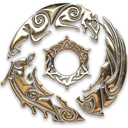
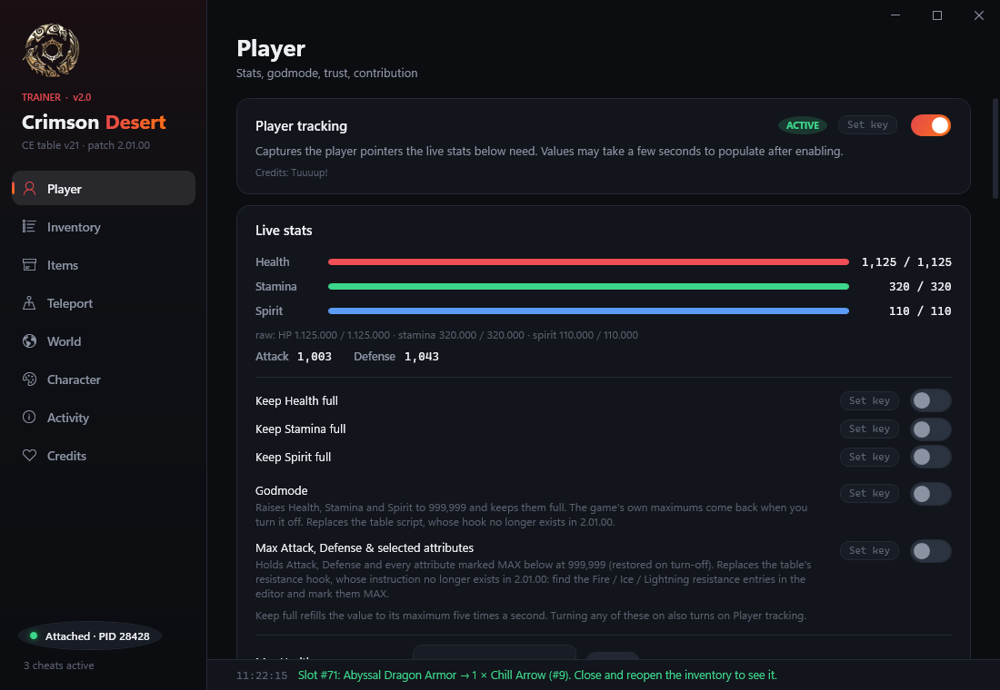
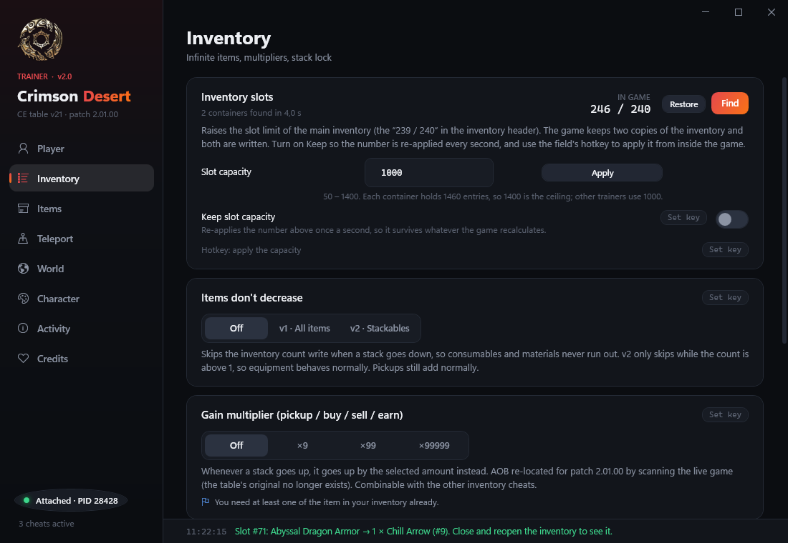
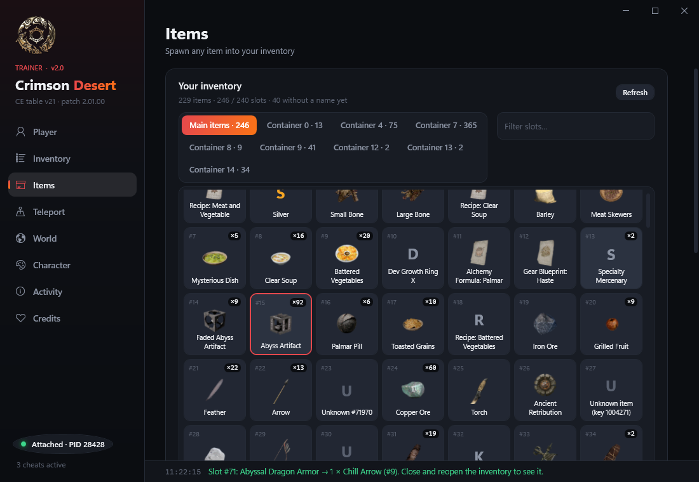
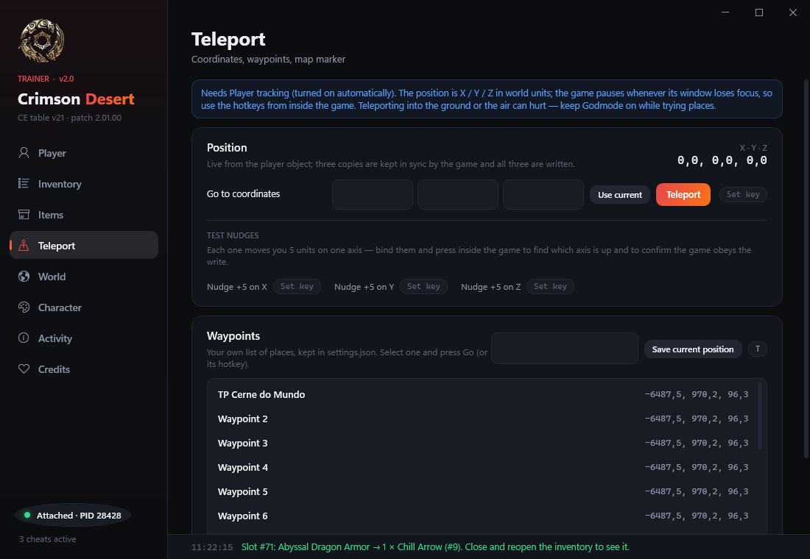
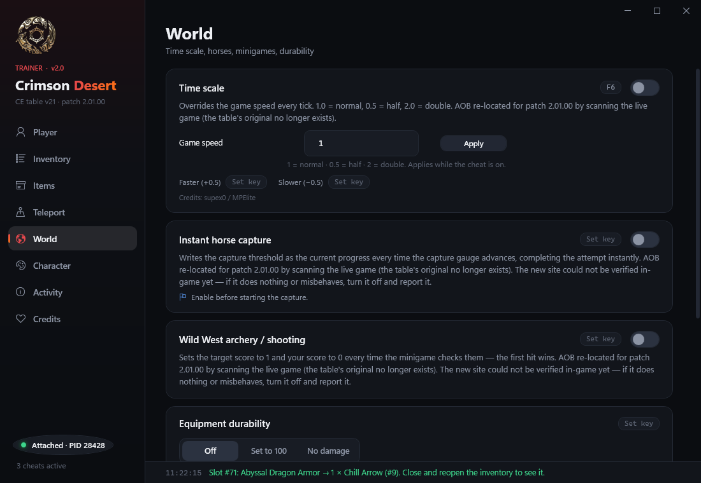
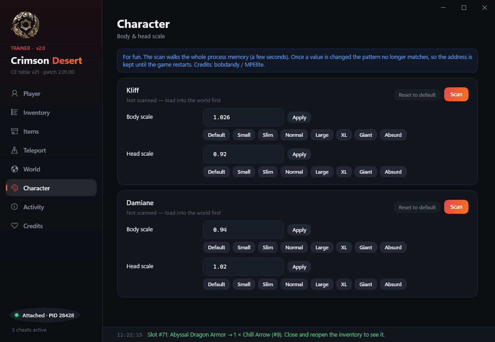

<p align="center">
  
</p>

<h1 align="center">Crimson Desert Trainer</h1>

<p align="center">
  Trainer gratuito e open source para <b>Crimson Desert</b> (patch 2.01.00) — C# / .NET 10 / WPF.<br>
  Hotkeys globais por recurso, spawner de itens com busca, inventário ao vivo e cada cheat da tabela Cheat Engine v21 portado para código.
</p>

<p align="center">
  <a href="https://github.com/viknacode/CrimsonDesertTrainer/releases">Releases</a> ·
  <a href="https://github.com/viknacode/CrimsonDesertTrainer/issues">Issues</a> ·
  <a href="CrimsonTrainer/README.md">Documentação técnica</a>
</p>

---

## Screenshots

| Player | Inventory |
|:---:|:---:|
|  |  |
| Stats ao vivo, keep full, godmode, Max Attack/Defense e editor dos 42 atributos de combate | Slots do inventário (até 1.400), items don't decrease, multiplicador de ganho, stack lock |

| Items | Teleport |
|:---:|:---:|
|  |  |
| Inventário lido do jogo como grade de slots, com ícones, filtro e spawner com busca em 6.000+ itens | Posição ao vivo, ir para coordenadas, waypoints salvos com hotkey |

| World | Character |
|:---:|:---:|
|  |  |
| Time scale, captura instantânea de cavalo, minigame de tiro, durabilidade | Escala de corpo e cabeça de Kliff e Damiane |

## Recursos

- **Player** — player tracking, stats ao vivo, keep Health / Stamina / Spirit full, godmode, Max Attack & Defense, atributos de combate marcáveis como **MAX**, max contribution, max trust (pessoas / pets / cavalo)
- **Inventory** — capacidade de slots (50–1.400), items don't decrease (v1 / v2), multiplicador ×9 / ×99 / ×99999, 99.999 copper ao vender, stack lock
- **Items** — grade do inventário lida direto do jogo (ícones via [crimsondb.gg](https://crimsondb.gg)), colocar qualquer item num slot ou só alterar a contagem
- **Teleport** — coordenadas X / Y / Z, "use current", waypoints persistidos em `settings.json`
- **World** — time scale, instant horse capture, Wild West archery, durabilidade 100 / sem dano
- **Character** — body & head scale (Kliff e Damiane) com presets
- **Hotkeys** — cada cheat tem hotkey global própria (*Set key* → pressione a combinação; Esc cancela, Backspace limpa); cheats com variantes ciclam entre as opções
- **Activity** — log de tudo que o trainer fez, útil pra reportar problemas

Cheats cujo padrão não existe na versão instalada aparecem esmaecidos com o motivo. Todo patch é restaurado quando o trainer fecha.

## Como usar

1. Baixe o `.exe` mais recente em [Releases](https://github.com/viknacode/CrimsonDesertTrainer/releases) (ou compile — abaixo)
2. Abra o jogo e carregue no mundo
3. Abra o trainer — ele acha o `CrimsonDesert.exe` sozinho e mostra **Attached · PID** no canto inferior esquerdo
4. Ligue os cheats pela interface ou pelas hotkeys de dentro do jogo

> Se `OpenProcess` falhar (erro 5), execute como **Administrador**. Não deixe a tabela Cheat Engine ativa ao mesmo tempo.
> As preferências (hotkeys, valores, waypoints) ficam em `%LocalAppData%\CrimsonTrainer\settings.json`.

## Compilar

Requer o [.NET 10 SDK](https://dotnet.microsoft.com/download).

```bash
dotnet build CrimsonTrainer -c Release
```

`.exe` único e autocontido:

```bash
dotnet publish CrimsonTrainer -c Release -r win-x64 --self-contained -p:PublishSingleFile=true
```

`--pid N` anexa só a esse processo (útil pra testes).

## Como funciona

Cada script da tabela vira uma *injection* em C#: o AOB é procurado no módulo, a cave é montada com
[Iced](https://github.com/icedland/iced) e o hook aplicado com as threads suspensas. Antes de patchar,
o trainer confere que a instrução ainda tem os bytes originais — se outra ferramenta já mexeu ali,
recusa e explica no log. Vários cheats de inventário compartilham um único hook, então podem ser
combinados. Os detalhes (offsets, ponteiros, o que foi rebaseado pro 2.01.00 e por quê) estão em
[CrimsonTrainer/README.md](CrimsonTrainer/README.md).

## Créditos

- Tabela Cheat Engine v21 — **MPElite**, **Tuuuup!**, **Austin**, **bobdandy**, **supex0** (padrões AOB e scripts que este trainer reimplementa)
- Ícones e nomes dos itens — [crimsondb.gg](https://crimsondb.gg)
- Desenvolvido por **ViknaCode**

*Crimson Desert* é marca registrada da Pearl Abyss. Este trainer é um projeto de fã independente,
sem afiliação ou endosso. Feito para diversão no single-player.
